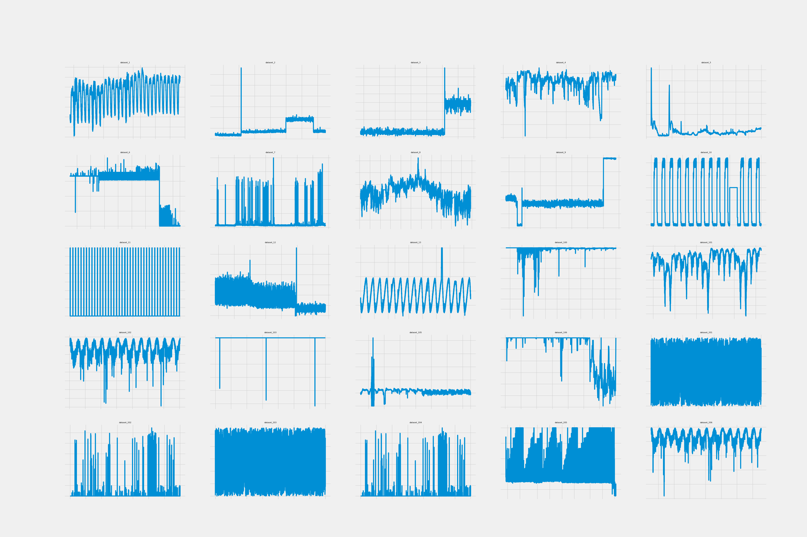
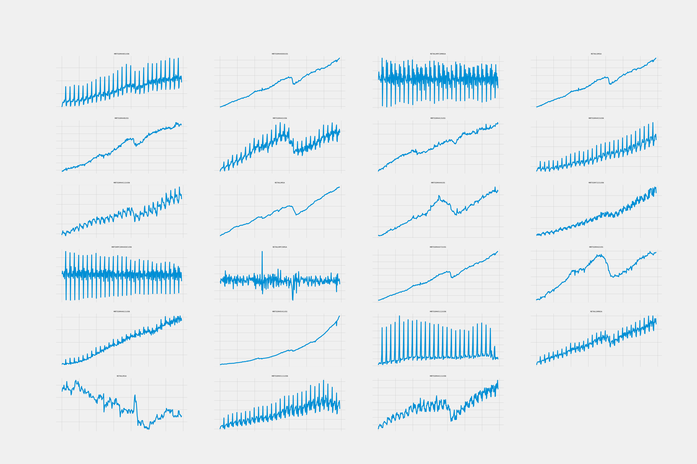

# **Time-series Modelling Case Studies**

This repo contains the code implementation for two case studies of time series modelling. This was a part of my interview process for the **Research Intern in Deep Learning** role at Huawei Ireland Research Center.

----
## First round: Technical

First round interview questions can be found [here](./resources/QUESTIONS.md)

## Second round: Case studies

The report for these case studies can be found [here](resources/report.pdf)

The purpose of the second round of interview is to assess your problem solving skills in real-world data science problems in the areas of time-series anomaly detection, prediction, and clustering. 

Data are contained in two subfolders: 

  1.	AD&P (data for anomaly detection and prediction case studies) 
  2.	C (data for clustering case study)

    
    

------

### **Case study 1: Anomaly Detection**
The task is to produce time-series point-anomaly detection models for each of the 25 Key Performance Indicators (KPI) time-series contained in AD&P folder. 

Specific requirements

<ul>
		<li> Each row associates a “time-stamp” with a “kpi_value”. The anomaly detector should be trained to detect point-anomalies in “kpi_value”. </li> 
    <li>	For the majority of time-series the problem is unsupervised (no point-anomaly labels). For some KPIs (datasets 201-206) we have also access to labelled data. In those cases labels can be taken into account if needed (optional). </li> 
    <li>	Each of the 25 time-series needs to be modelled independently of others. </li>
    <li>	Slides with description of the anomaly detection method chosen.  </li>
    <li>	Slides with visualisation of anomaly detection output in whole time-series, for each of the 25 time-series. </li>
    <li>	During presentation, issues of scalability, adaptation, model selection, generalisation will be discussed. </li>

-----
### **Case 2: Prediction**

The task is to produce time-series prediction models for each of the 25 Key Performance Indicators (KPI) time-series contained in AD&P folder. 

Specific requirements

<ul>
  <li>	For each of the 25 time-series train a model to forecast the kpi_value at time t+1, t+2, t+3, t+4, t+5, given information up to time t.</li>
  <li>	Slides with description of the prediction method chosen. </li>
  <li>	Slides with train/test prediction performance assessment. </li>
  <li>	Slides with visualisation of prediction versus actual time-series values. </li>
  <li>	During presentation, issues of scalability, adaptation, model selection, generalisation will be discussed.</li>

-----

### **Case study 3: Clustering**

The task is to cluster the 23 time-series contained in the C folder.

Specific requirements

<ul>
  <li>	Monthly time-series data: “value” column associated with “date” column. </li>
  <li>	Number of optimal cluster should be emergent through your analysis.</li>
  <li>	Slides with description of the clustering method chosen. </li>
  <li>	Visualisation of clustering results. </li>
  <li>	During presentation, issues of scalability and model selection will be discussed. </li>

